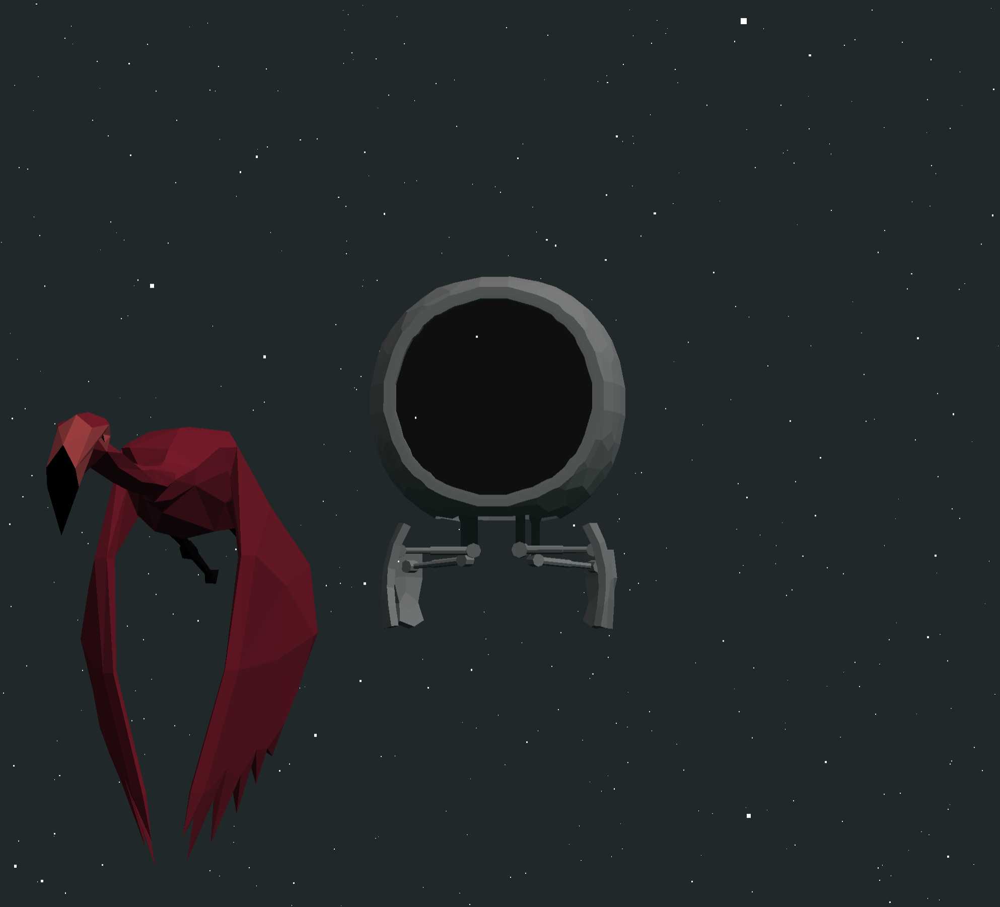

# Project M4NG0 - A Three.js Framework
### This is a template for advanced multi-scene `Three.js` projects.

[Photo shameless taken from images.indianexpress.com]

# Live Demo
See the live demo here: https://evandaley.github.io/Three.js-M4NG0-Framework/

## Embrace the Mango:

M4NG0 takes away the headache of starting a new three.js project by imposing order, and modularizing the core elements of a three.js project

- M4NG0 does the grunt work: we provide an asset loader, scene manager, full-screen canvas, renderer, camera, default lighting, and a bunch more stuff that doesn't come by default with three.js.
- Prefabs are introduced as the primary building block. This helps greatly in organizing your code.
- Asset management is greatly simplified. Meshes are loaded automatically and can be shared between scenes.
- Scenes are more intuitive (default camera, lighting, added behaviors) and have a simple event lifecycle.
- Our Webpack configuration makes it easy to dev and deploy to any environment (S3, github pages, whatever).

Optional advanced features:
- GSAP provides a simple API for extremely customizable animations
- Deploy to github pages with a single npm command.
- Customizable loading screen displays until assets finish loading (in development)

## How is this different from other frameworks?
M4NG0 is small and **opinionated**. It doesn't come with a lot of bells and whistles, but gives you a strong organized foundation and provides quality of life improvements like prefab support, better asset management, scene management, and a simple event lifecycle for objects. But if you're looking for a complete game engine, this isn't it! 

## Project Structure
### Overview
Okay, lets dive in. I've got a detailed "first steps" section below - but I suggest skimming this section to get familiar with the basics first. Heres what you need to know:

1. On page load, we create an instance of `Orchestrator`. Orchestrator sets up our renderer and all of the helpers like our asset loader and scene manager.
2. As soon as its ready, `Orchestrator` kicks off the process of loading up the static assets like 3d models and textures that are referenced by your scenes. This will ONLY pull assets that are referenced by Scenes/Prefabs. Every non-primitive object should be defined as a prefab and imported into a scene.
3. Once everything has finished loading in the background, `Orchestrator` will call the async function `start` on the first scene.
4. Scenes are defined by you! We provide one example, and make it easy to create your own. By default, all new scenes come with a camera and basic lighting. All scenes should extend the base class M4Scene. More on that later.

### Prefabs
Prefabs are custom classes that define the form and function of an object. They specify which assets to pull and how those assets should behave in the scene. Everything is a prefab. 

### Assets
If you have any models or textures to load, put them in `./static/models` and `./static/textures`. Assets will be pulled in by the AssetLoader class on page load. Note that we only load assets that are referened by prefabs! 

### Classes of Note
- Orchestrator: Creates the systems that manage everything. This is the interface that lets you switch scenes or interact directly with the renderer.
- AssetLoader: Loads your assets asynchronously. Maintains them in an array, so you can reuse them in any scenes.
- M4Scene: Acts as the basic building block for your custom scenes. An `M4Scene` is an instance of a `Three.Scene` with added behavior. Comes with lights and a camera by default. Extend this with your own scenes.
- M4Prefab: This is the class you should extend to create any kind of object that has behavior. Robot.js is a good example. The method `tick(delta)` is M4NG0's equivalent of `OnUpdate` and will be called on any prefab that sets isAnimatable to true. Tick passes a "delta" which indicates how much time passed between frames. We don't have a fixedUpdate equivalent.

Now that we've covered the basics, lets work toward making some modifications.

## First Steps - Setup
Clone this project.

`cd` into that folder.

Run following commands:

``` bash
# Install dependencies (only the first time)
npm install

# Run the local server at localhost:8080
npm run dev
```
At this point, a lite-server should be serving the project locally on port 8080.

While the server is running, code will immediately be reflected in the browser.

## First Steps - Development
Next we'll create a new prefab, with `src/prefabs/Robot.js` as an example:
- In Robot.js we set some defaults in the constructor. `this.isAnimatable = true` tells the system to call `tick` on this class every frame.
- We specify our required assets `models/Robot.glb`
- Then, we define our start method which will be called after the static assets have been loaded.

Lets make a new prefab
- Duplicate robot.js and call it Flamingo.js
- Change the class name and export
- Try loading a different model (perhaps `models/Flamingo.glb`)
- Reposition the model in the `start` function

Now you should have:
```
import { M4Prefab } from "../M4NG0/Objects/M4Prefab"

class Flamingo extends M4Prefab {
  requiredAssets() {
    return [{
      type: 'model',
      filePath: 'models/Flamingo.glb',
    }]
  }

  start() {
    this.position.x = -2
  }
}

export { Flamingo }
```

Now lets import that into a scene.
- In `src/Scenes/CustomScene1.js` we just need to add an import, and update the Scene Blueprint with our new Flamingo prefab.
```
  import { Flamingo } from "../Prefabs/Stork"
 
  ...

  blueprint() {
    return {
      prefabs: [
        Robot,
        Flamingo,
        ParticleEffect
      ]
    }
  }
```
And voila, we have a Flamingo in our scene!


[You should now see a flamingo!]

The process of loading the mesh and adding it to the scene was handled by the AssetLoader and Orchestrator. If you need to hook into that process to interact with the mesh data, you can add a processImportData() method on whatever prefab needs it. See `M4Prefab` for an example.

Alright - now we've made some changes. Let's take a look at how to build a deployable package and push it to a server.

## Deployment
To build a deployable package:
```
# Generate packages to ./dist folder.
npm run build
```
You can deploy anywhere by moving the files from `./dist` to any static fileserver (s3, hostgator, whatever)

If you have a repo, but don't have a webserver, I recommend deploying straight to github pages, a free static fileserver hosted by github. 

Deploy to github pages with:
```
# Trigger a commit to the github pages branch
npm run deploy
```
Then, on github, go into your repo settings->pages and choose `gh-pages` as the branch (and save!).

## FAQ
#### How do I add M4NG0 to an existing project?
This is doable, but a bit of work.
- Bring over the whole src folder, static folder, and webpack config.
- Then add a canvas to your html with the id: `m4ng0-canvas`.
